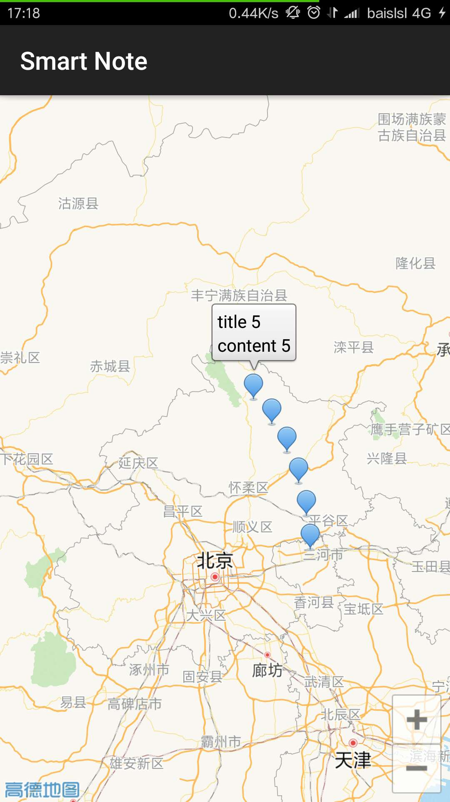

# awesome-note

***

## 设计

### 使用到的开源库

- [JazzyListView](https://github.com/twotoasters/JazzyListView)，主界面使用

- [RichEditor](https://github.com/wasabeef/richeditor-android)，编辑界面

- [LitePal](https://github.com/LitePalFramework/LitePal)，实现笔记内容本地存储

在此对以上各个开源项目的贡献者表示衷心的感谢
Special thanks for the above project developers!

### 界面

- 程序主界面，局面布局使用 [JazzyListView](https://github.com/twotoasters/JazzyListView),增加滑动效果

- 笔记编辑器，使用开源库[RichEditor](https://github.com/wasabeef/richeditor-android)，实现编辑时undo，redo和文字效果

- 地图搜索， 根据地图位置打开对应的笔记，地图API我们使用的是高德地图提供的Android API



### 数据存储

#### 本地数据保存

Android提供了SQLite数据库，但是在使用时不是很方便，所以使用了[LitePal](https://github.com/LitePalFramework/LitePal)来实现笔记本的存储。

其中保存对象主要为Note类，Note数据为

```java
private String content;

private Long id;
private String title;

private double latitude, longitude;
```

### TODO

- 编辑器插入本地图片
- 很多界面的美化
- 笔记根据标签分类
- 位置确定算法（因为可能在一个地方创建又在很多其他地方编辑，而当前是只记录了创建位置）
- 桌面插件的生成
- a lot of todos
